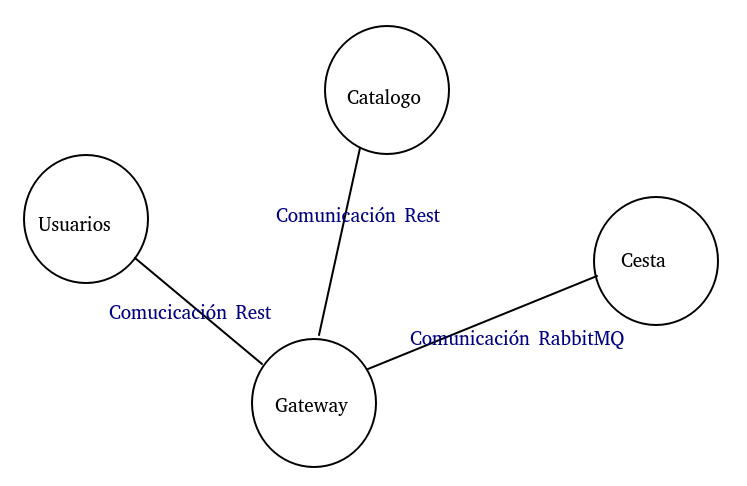

# Personal Web Project:

Tenemos como proyecto para una tienda Online, vamos a hacer parte del proyecto personal en esta asignatura, queremos tener un servicio web Restful que proporcione servicio a una futura aplicación con la que los clientes puedan ver los productos ofertados, comprar o visualizar sus compras anteriores y gestionar las ventas de la tienda.

## Arquitectura:

En el proyecto nos vamos a basar en una arquitectura basada en microservicios, vamos a intentar implementar varios microservicios, como mínimo dos que interactúen entre si.

La comunicación de cliente al microservicio principal se haría a través de una puerta de enlace de APY Rest (HTTP).
La comunicación entre diferentes microservicios lo vamos a implementar con la tecnología de infraestructura de agente de mensajería RabbitMQ, ya que es open source y es compatible con muchos lenguajes. 

Cada microservicio se intentará hacer en un lenguaje de programación diferente, aunque como lenguaje principal vamos a usar Ruby con el Framework [sinatra](http://sinatrarb.com/) para servicios web, es open source, es flexible y rápido.

Para la integración continua vamos a usar [Travis-CI](https://travis-ci.com/).

Las bases de datos a usar serán MongoDB y PostgreSql, como usaremos una para cada microservicio, dependerá del lenguaje de programación del mismo.

PostgreSQL es un sistema de gestión de bases de datos relacional orientado a objetos y de código abierto (gratuito y libre) y MongoDB es un sistema de base de datos NoSQL orientado a documentos y también es de código abierto, principal razón para nuestra elección.

***Microservicios:***

     - Gestión de perfiles de usuario (registrarse y login).
     - Gestión de la base de catalogo de productos.
     - Muestra los pedidos de un usuario (cesta de la compra).
     - Gestión de ventas.

[Documentación de microsoft sobre microservicios y su arquitectura.](https://docs.microsoft.com/es-es/dotnet/architecture/microservices/multi-container-microservice-net-applications/microservice-application-design)