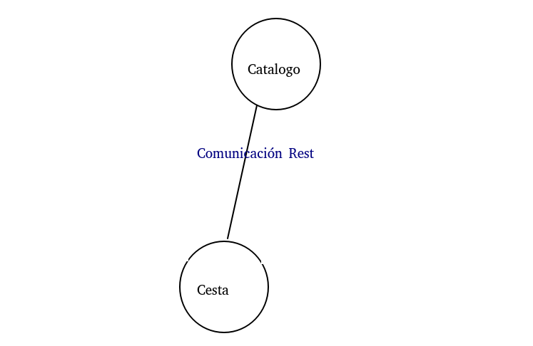

# Personal Web Project:

Tenemos como proyecto para una tienda Online, vamos a hacer parte del proyecto personal en esta asignatura, queremos tener un servicio web Restful que proporcione servicio a una futura aplicación con la que los clientes puedan ver los productos ofertados, comprar o visualizar sus compras anteriores y gestionar las ventas de la tienda.

## Arquitectura:

* En el proyecto nos vamos a basar en una arquitectura basada en microservicios, vamos a intentar implementar varios microservicios.

* La comunicación entre "Gateway" y los microservicios "Catalogo" y "Usuarios" será a través de paso de mensajes con Api Rest, sin embargo la comunicación entre "Gateway" y "Cesta"  vamos a implementar el Bróker de agente de mensajería RabbitMQ, ya que es open source y es compatible con muchos lenguajes. Vamos a usar una configuración distribuida con etcd.

***Microservicios:***

     - Usuarios.
     - Catalogo.
     - Cesta.

* Enlace a la documentación extendida de la [arquitectura](doc/arquitectura.md) (correspondiente al hito 0).

* Cada microservicio se intentará hacer en un lenguaje de programación diferente, aunque como lenguaje principal vamos a usar Ruby con el Framework [sinatra](http://sinatrarb.com/) para servicios web, es open source, es flexible y rápido.

* Para la integración continua vamos a usar [Travis-CI](https://travis-ci.com/).

* Las bases de datos a usar serán MongoDB y PostgreSQL, como usaremos una para cada microservicio, dependerá del lenguaje de programación del mismo.

* Para la gestión de bibliotecas usaremos RubyGems.

* Alojaremos los distintos microservicios de nuestra aplicación en contenedores Docker.

* Haremos un despliegue en la nube, para ello estamos barajando las plataformas Azure ó Amazon.

## Historias de usuario:

* Cualquier usuario  accederá al catalogo de compras, el usuario identificado podrá obtener información de los artículos que haya comprado sólo ingresando su email. Por cada acción del sistema, se guardará el log.

Enlace a las historias de usuario que coinciden con [Milestones](https://github.com/mati3/CC-WebProject/milestones) e Issues iniciales:
* [Elección de proyecto y organización.](https://github.com/mati3/CC-WebProject/milestone/1)
    - [Tema.](https://github.com/mati3/CC-WebProject/issues/3)
    - [License.](https://github.com/mati3/CC-WebProject/issues/2)
    - [gitignore.](https://github.com/mati3/CC-WebProject/issues/1)
    - [Extender definición proyecto.](https://github.com/mati3/CC-WebProject/issues/4)
* [Documentación.](https://github.com/mati3/CC-WebProject/milestone/2)
    - [Añadir historias de usuario.](https://github.com/mati3/CC-WebProject/issues/22)
    - [Documentación integración continua.](https://github.com/mati3/CC-WebProject/issues/9)
    - [Documentación desarrollo microservicios.](https://github.com/mati3/CC-WebProject/issues/10)
    - [Documentación laas.](https://github.com/mati3/CC-WebProject/issues/11)
    - [Documentación paas.](https://github.com/mati3/CC-WebProject/issues/12)
    - [Documentación Docker.](https://github.com/mati3/CC-WebProject/issues/13)
* [Integración continua.](https://github.com/mati3/CC-WebProject/milestone/4)
    - [Subir .travis.yml](https://github.com/mati3/CC-WebProject/issues/14)
    - [Subir test de comprobación.](https://github.com/mati3/CC-WebProject/issues/15)
    - [Subir Rakefile.](https://github.com/mati3/CC-WebProject/issues/16)
    - [Subir Gemfile.](https://github.com/mati3/CC-WebProject/issues/17)
* [Desarrollo microservicios.](https://github.com/mati3/CC-WebProject/milestone/3)
    - [Añadir funciones.](https://github.com/mati3/CC-WebProject/issues/18)
    - [Añadir base de datos.](https://github.com/mati3/CC-WebProject/issues/19)
    - [Añadir log.](https://github.com/mati3/CC-WebProject/issues/20)
    - [Añadir comunicación.](https://github.com/mati3/CC-WebProject/issues/21)
* [Despliegue en LaaS.](https://github.com/mati3/CC-WebProject/milestone/5)
* [Despliegue en PaaS.](https://github.com/mati3/CC-WebProject/milestone/6)
* [Contenedores Docker.](https://github.com/mati3/CC-WebProject/milestone/7)