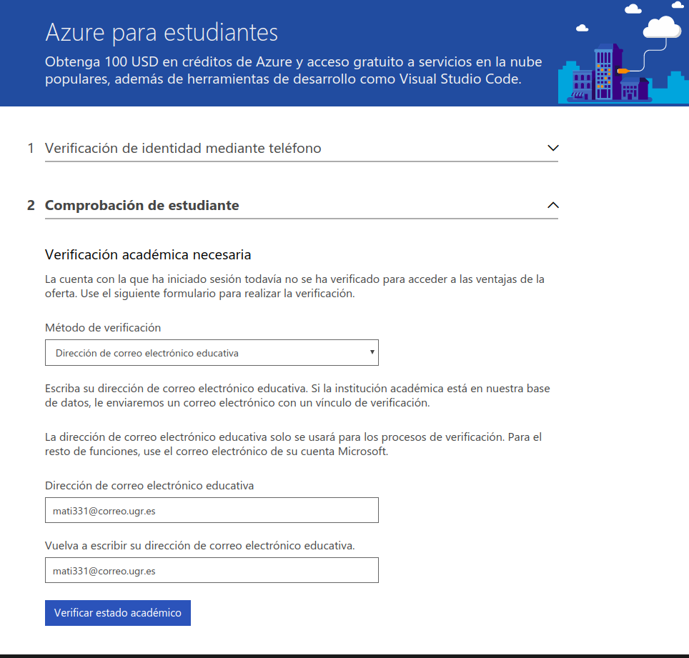
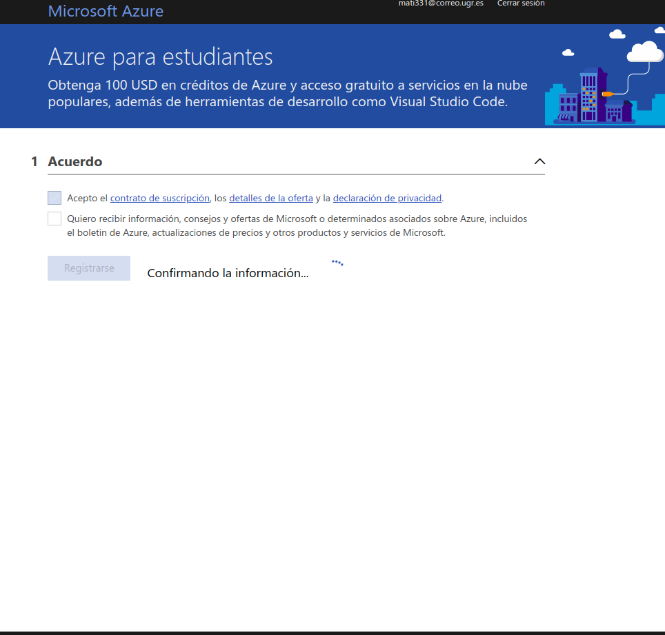
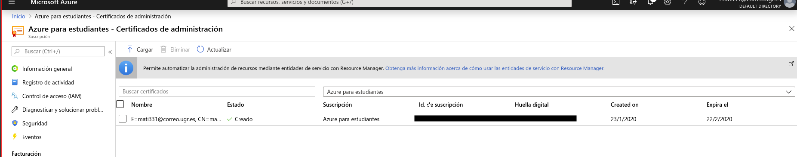
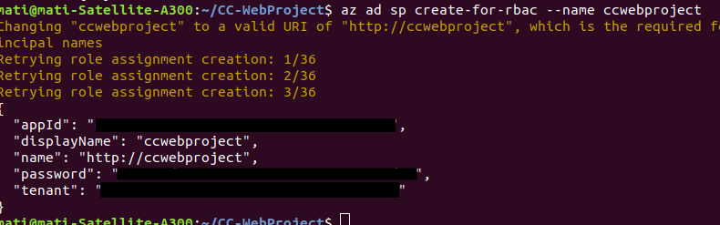
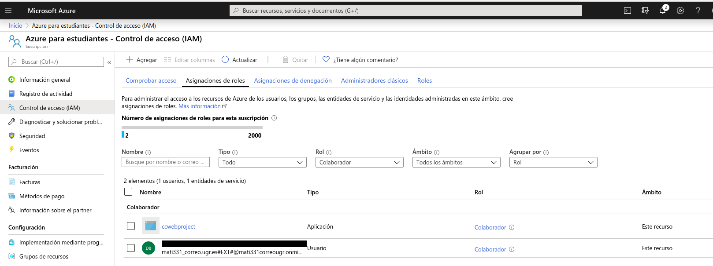
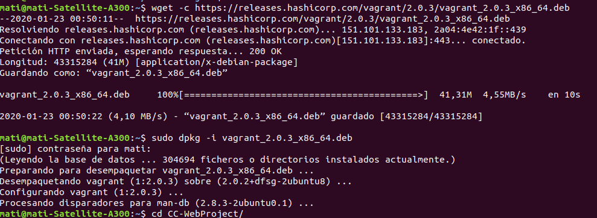
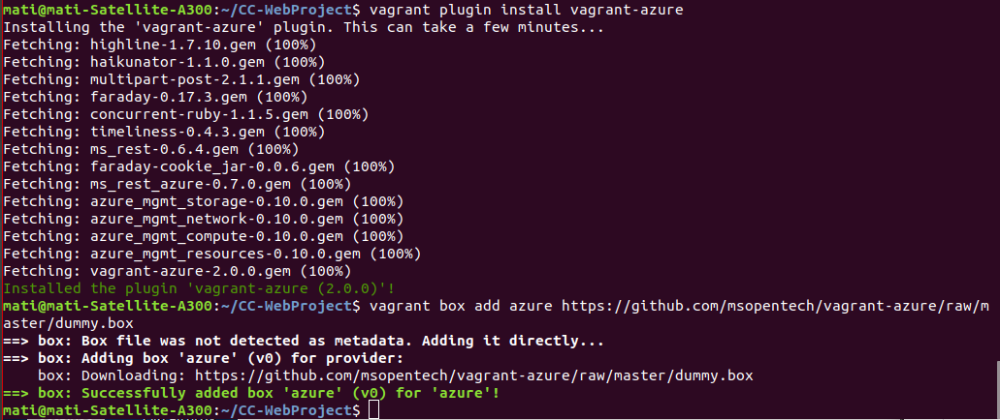
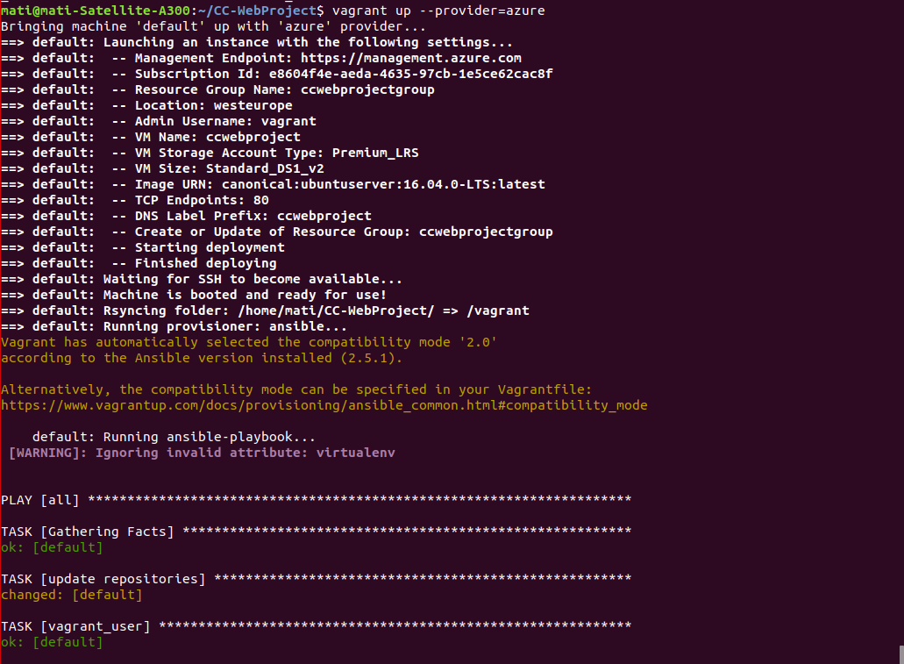
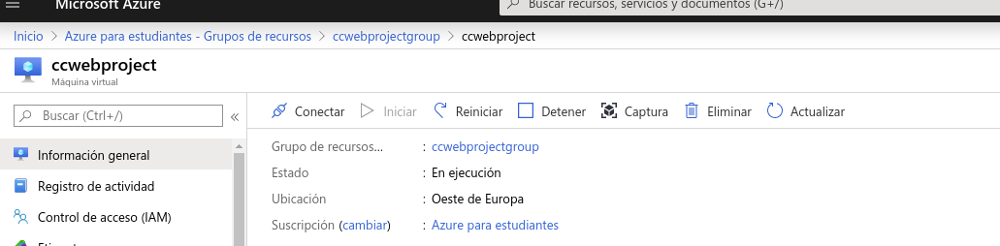

# Azure

Como ya tenemos cuenta en Azure vamos a desplegar nuestro proyecto en Microsoft Azure, lo primero que hacemos es activar una nueva suscripción gratuita para estudiantes:

Creamos un certificado auto-firmado llamado:

    openssl req -x509 -newkey rsa:2048 -keyout ccwebproject.pen -out ccwebproject.key
    chmod 400 ccwebproject.key
    openssl x509 -inform pem -in ccwebproject.key -outform der -out ccwebproject.cer

Subimos el certificado .cer a Azure:

Como ya tenemos la Cli de Azure instalada en nuestro pc, nos logueamos desde la misma para la cuenta recién creada.

    az login

Nuestra suscripción de Azure está actualizada, así que creamos nuestro servicio principal ccwebproject.

Comprobamos los permisos y roles que tenemos, como mínimo debemos ser colaboradores.

Hacemos la provisión con Ansible y Vagrant, tenemos que actualizar Vagrant porque no podemos instalar el pluying de Azure.

Para un despliegue desde cero en Azure, consultar [mi primera instalacion](https://github.com/mati3/Gestion-Medicamentos-IV/blob/master/doc/azure.md).

Por último, siempre hay que dejar la máquina para pruebas en Azure apagada para no malgastar los recursos.

