#Contenedores

Ya tenemos docker instalado, dejamos el archivo de ejecución para su instalación, lo ejecutamos con "Ansible".

            - name: Install prerequisites docker 
              apt:    
               update_cache: yes
              with_items:
               - apt-transport-https
               - ca-certificates
               - curl
               - software-properties-common

            - name: Add Docker GPG key
              apt_key: 
                url: https://download.docker.com/linux/ubuntu/gpg

            - name: Verify that we have the key with the fingerprint
              apt_key:
                id: 0EBFCD88
                state: present

            - name: Add Docker APT repository
              apt_repository:
                repo: deb [arch=amd64] https://download.docker.com/linux/ubuntu bionic stable
                update_cache: yes

            - name: Install Docker
              apt: 
                name: docker-ce
                state: latest

            - name: Put user
              command: "usermod -aG docker $USER"

Hacemos dos archivos Dockerfile, uno con Ruby:

        FROM ruby:2.6.0

        LABEL maintainer="mati331@correo.ugr.es"

        RUN mkdir /Catalogo
        WORKDIR /Catalogo
        ENV HOME /Catalogo

        # lanzar errores si Gemfile ha sido modificado desde Gemfile.lock
        RUN bundle config --global frozen 1

        COPY Catalogo/Gemfile Catalogo/Gemfile.lock ./

        RUN gem install bundler -v 2.0.2
        RUN bundle install

        COPY Catalogo .

        # Comando predeterminado, ejecutando la aplicación como un servicio
        CMD ["rake","foreman","env=1"]

El segundo con Alpine:

        FROM ruby:2.6.0

        LABEL maintainer="mati331@correo.ugr.es"

        RUN mkdir /Catalogo
        WORKDIR /Catalogo
        ENV HOME /Catalogo

        # lanzar errores si Gemfile ha sido modificado desde Gemfile.lock
        RUN bundle config --global frozen 1

        COPY Catalogo/Gemfile Catalogo/Gemfile.lock ./

        RUN gem install bundler -v 2.0.2
        RUN bundle install

        COPY Catalogo .

        # Comando predeterminado, ejecutando la aplicación como un servicio
        CMD ["rake","foreman","env=1"]

A destacar del archivo:

- Como Alpine viene con lo mínimo, primero actualizamos los repositorios, luego añadimos [bundler](https://pkgs.alpinelinux.org/package/edge/main/x86/ruby-bundler) y [ruby-full](https://pkgs.alpinelinux.org/package/edge/main/x86/ruby-full). Después de probar e instalar muchos paquetes, hemos preferido instalar solo ruby-full que tiene todas las dependencias necesarias para la instalación.

- Al copiar "COPY COPY Gemfile Gemfile.lock ./" y ejecutar "RUN bundle install", se crea una capa inferior de imagen, separada. con la siguientes instrucción "COPY Catalogo .", se copian los archivos necesarios de la app en la imagen, los cuales están todos dentro de la carpeta Catalogo. Esto implica que si alguno de los archivos de la capa inferior cambia, se puede reconstruir la imagen usando la misma de la caché. Mucho más eficiente que construir todo desde cero.

Hemos comparado los y Alpine que tiene un tamaño menor:

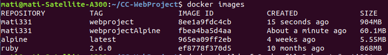

Construimos y lanzamos nuestro proyecto con Docker:

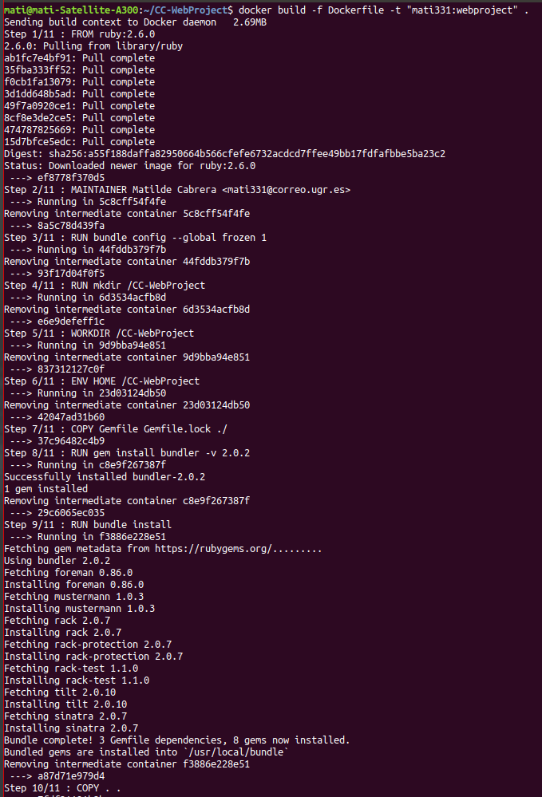

Entramos a los contenedores para corregir algunos errores y lo probamos en local:

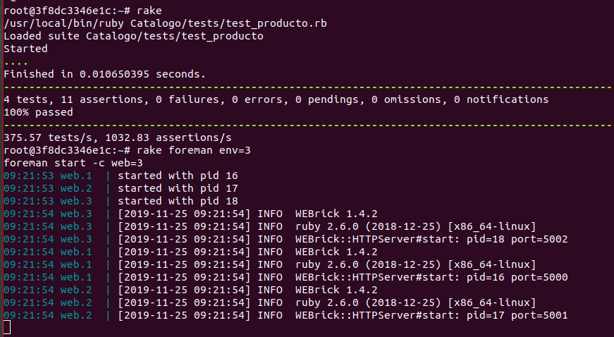

Instalamos [apache benchmark](https://ubunlog.com/apachebench-carga-pagina-web/) para hacer una prueba de carga sobre los contenedores creados:

        sudo apt install apache2-utils

Con el servidor en funcionamiento probamos ab con la siguiente opciones:

    -k Múltiples solicitudes dentro de una sesión HTTP.
    -n Número de solicitudes a ejecutar.
    -c Conexiones concurrentes.

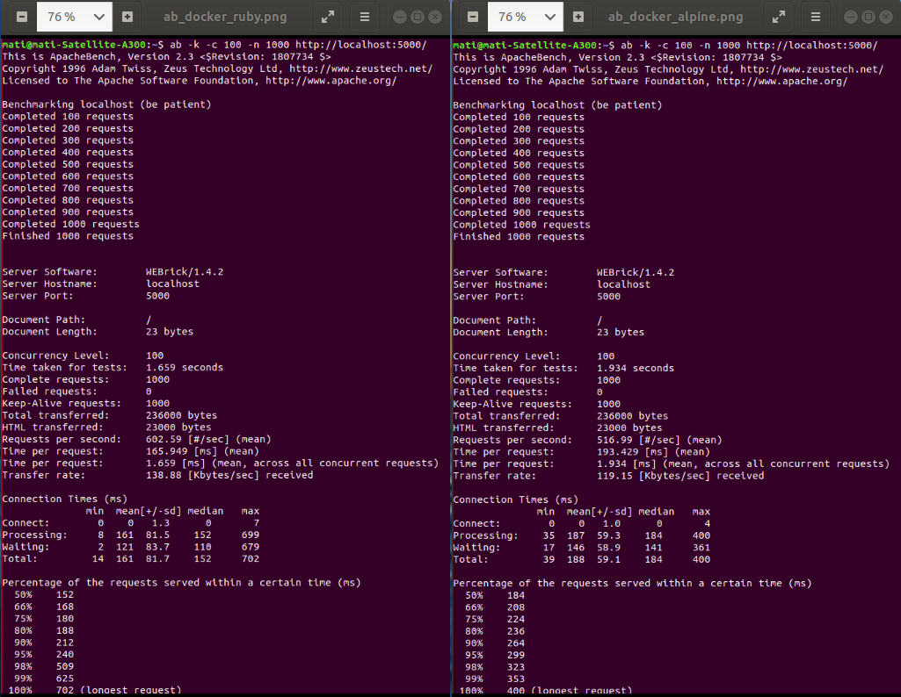

Como podemos observar en la imagen anterior, en el contenedor creado con Alpine, podemos tener 516,99 peticiones por segundo a nuestra app frente a 602,59 del contenedor Ruby (Requests per second, mean).
El tiempo promedio para atender un grupo de peticiones es menor en el contenedor Ruby (Time per request, mean), y por supuesto el tiempo promedio para atender una petición también es menor en Ruby (Time per request -mean, across all concurrent requests).

Sopesamos el peso de los test de carga y ***nos quedamos con la imagen Ruby.***

Alojamos nuestro contenedor Docker en [Docker-hub](https://hub.docker.com/r/mati3/webproject), Docker-hub es una plataforma donde podemos alojar aplicaciones desde nuestro equipo. Tan solo tenemos que entrar, puesto que ya tenemos cuenta, incluir el repositorio asignándole un nombre y enlazándola a nuestro GitHub:

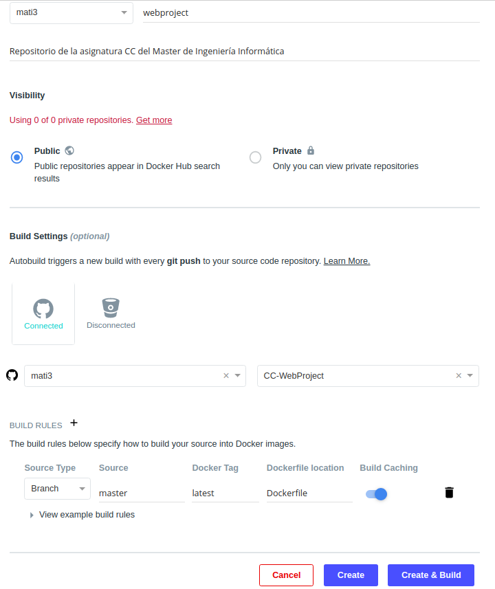

Ajustamos para un autobuild, que se refresque automáticamente cada vez que hacemos un push en GitHub:

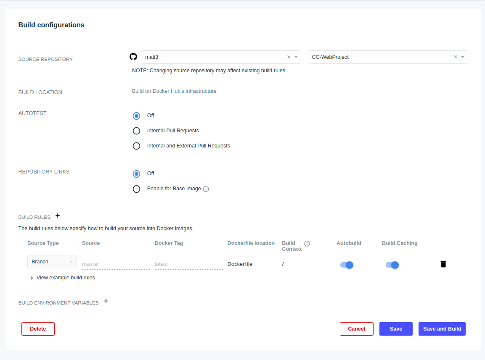

De igual forma usamos [Heroku](https://dashboard.heroku.com/apps/cc-webproject) como PaaS, su uso es muy fácil ademas gratuito, los servicios tienen una conexión HTTPS lo que le da un protocolo seguro. Es una infraestructura estable garantizada por [AWS](https://aws.amazon.com/marketplace/pp/Heroku-Inc-Heroku-Cloud-Application-Platform/B008DJG1TY#product-description).

[Heroku](https://devcenter.heroku.com/) es compatible con multitud de lenguajes de programación con Ruby, Java, Python, Node.js, etc. Es multiplataforma y lo mas importante admite git privados. 

Por todo ello es una excelente opción para el desarrollo de una aplicación.

Necesitamos un archivo heroku.yml para levantar la imagen docker en [Heroku](https://devcenter.heroku.com/articles/build-docker-images-heroku-yml
), es muy simple, tan solo le indicamos el archivo que levantará en la web de Heroku:

        build:
          docker:
            web: Dockerfile

Creamos una nueva app:

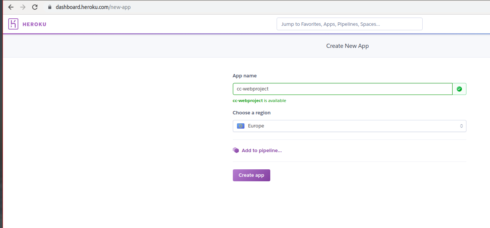

La enlazamos a nuestro repositorio de Github:

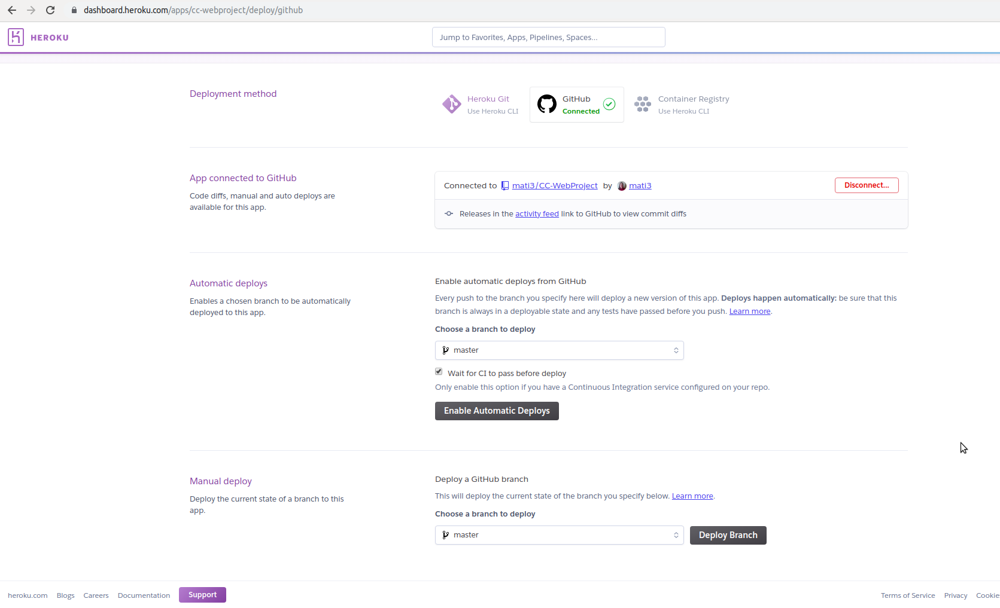

Desplegamos la app:

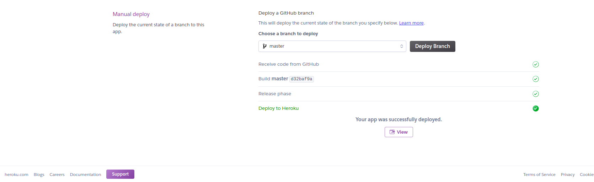

Podemos probar nuestra aplicación con las siguientes rutas:

- [https://cc-webproject.herokuapp.com/](https://cc-webproject.herokuapp.com/)  
- [https://cc-webproject.herokuapp.com/todos](https://cc-webproject.herokuapp.com/todos)
- [https://cc-webproject.herokuapp.com/producto/00101](https://cc-webproject.herokuapp.com/producto/00101)
- [https://cc-webproject.herokuapp.com/producto/00102](https://cc-webproject.herokuapp.com/producto/00102)
- [https://cc-webproject.herokuapp.com/producto/00103](https://cc-webproject.herokuapp.com/producto/00103)
- [https://cc-webproject.herokuapp.com/producto/00104](https://cc-webproject.herokuapp.com/producto/00104)

Probamos su funcionamiento:

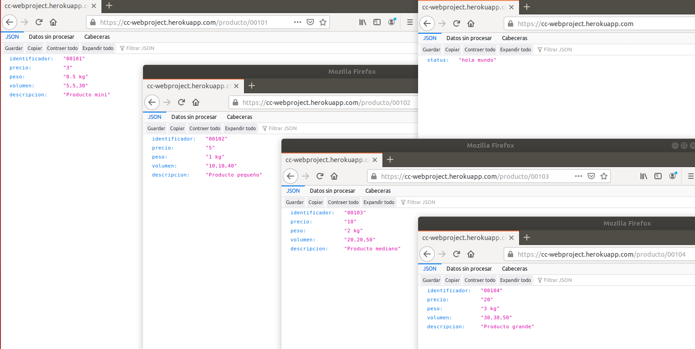

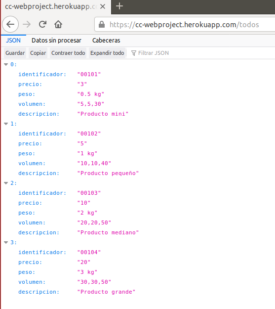

