# Integración continua:

## Ruby

***Para la integración continua de nuestro proyecto vamos a usar [Travis-CI](https://travis-ci.com/).***

Vamos a la página oficial de Travis-CI y como ya tenemos cuenta accedemos con GitHub.

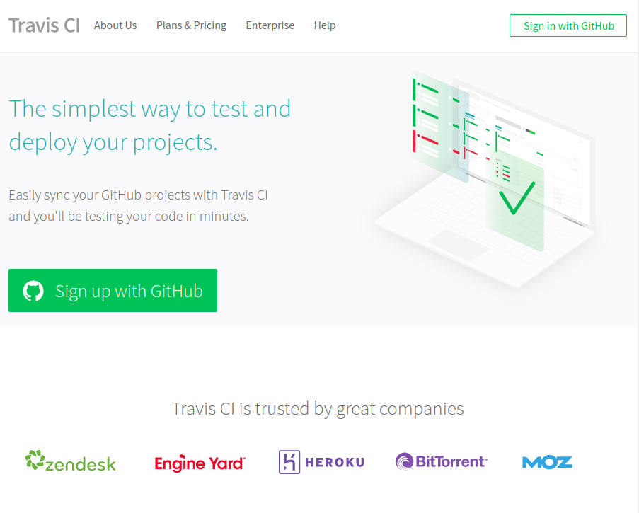

Manage repositories on github

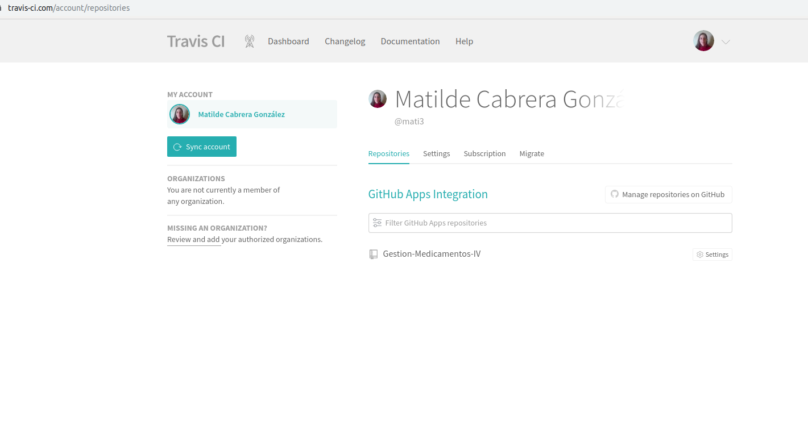

Nos identificamos

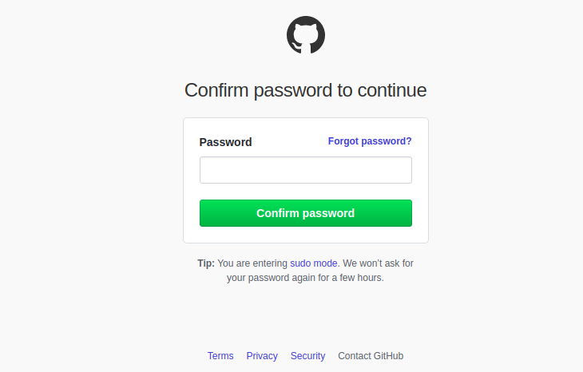

Seleccionamos el nuevo repositorio

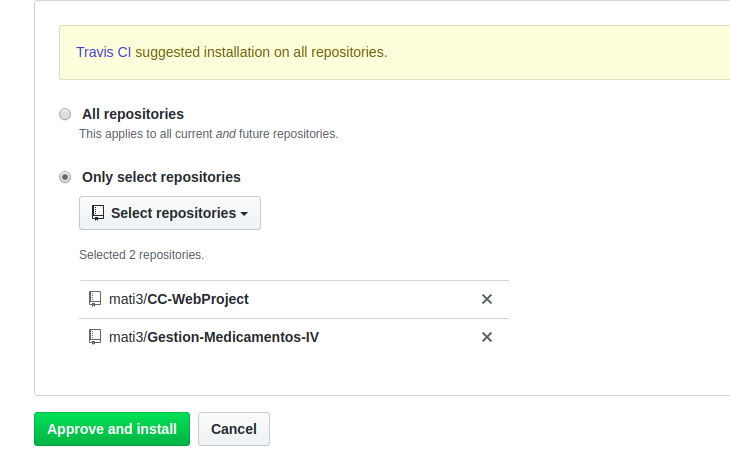

Vemos los repositorios en Travis-CI

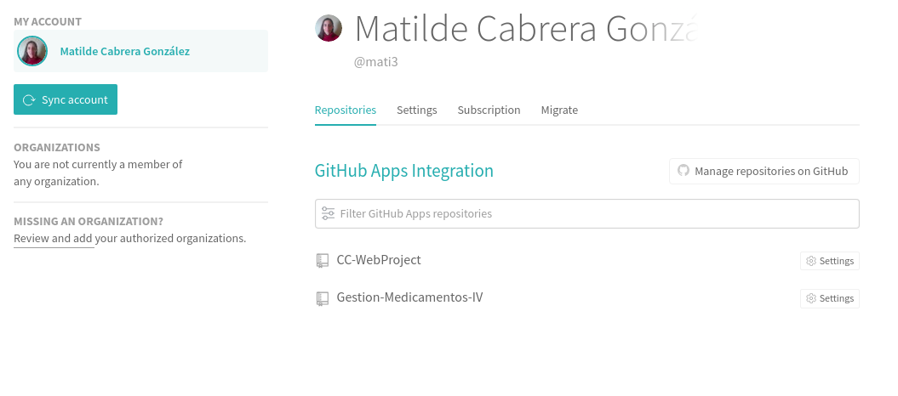

Nuestro proyecto recién incluido

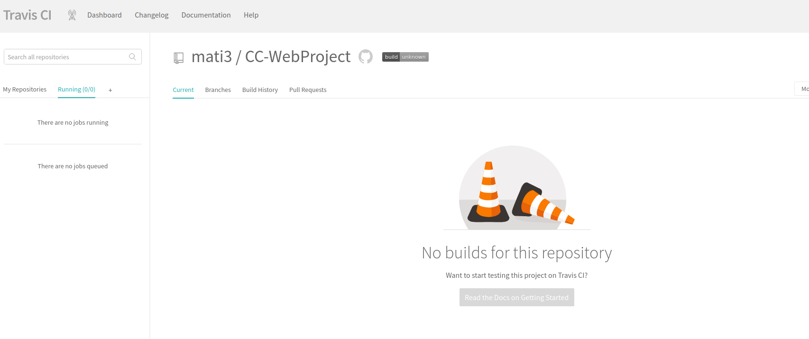

***Seguimos el siguiente [tutorial de travis](https://docs.travis-ci.com/user/tutorial/).***

Por otro lado vamos a usar Ruby para nuestro proyecto. 
Necesitamos un [manejador](https://www.ruby-lang.org/es/documentation/installation/) (controlador de versiones), con un manejador puedes cambiar entre versiones de Ruby en tu sistema. Hemos elegido RVM que te permite instalar versiones diferentes de Ruby. Para ver como funciona hemos instalado 3 versiones y hemos elegido una.

    gpg --keyserver hkp://pool.sks-keyservers.net --recv-keys 409B6B1796C275462A1703113804BB82D39DC0E3 7D2BAF1CF37B13E2069D6956105BD0E739499BDB

    curl -sSL https://get.rvm.io | bash -s stable 

    exec bash --login --> password

    rvm install ruby-2.3.0

    rvm use 2.3.0

Nota: si rvm no nos deja elegir una versión, seguir los [siguientes pasos](https://stackoverflow.com/questions/23963018/rvm-is-not-a-function-selecting-rubies-with-rvm-use-will-not-work/23963123)

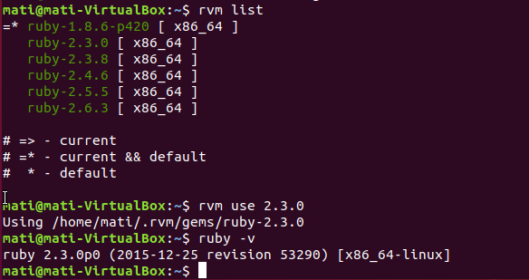

Hemos elegido la versión 2.3.0 porque es la versión mínima para usar Bundler.

Para manejar las dependencias de Ruby vamos a usar [Bundle](https://bundler.io/es/), el cual provee un ambiente consistente para nuestros proyectos asegurando que las gemas que necesitamos estén instaladas en el entorno en el que trabajamos.

 En ruby a las librerías se les conoce como gemas, Bundle nos ayuda a agrupar cada una de las gemas que necesitamos para nuestro proyecto así como las versiones de las mismas. Esto nos ayudará en el caso de que tengamos varios proyectos que necesiten versiones diferentes de las mismas gemas o en caso de que queramos cambiar de máquina. Pero a su vez Bundle es también una gema, así que lo primero es instalarla.

    gem install bundler
    bundle install

Nosotros vamos a automatizar esta tarea con Rake, de forma que ejecutaremos:
        
        rake build

Bundler instalará todas las gemas que hayamos especificado en nuestro archivo Gemfile:

        source "https://rubygems.org"

        gem 'sinatra'

La gema de sinatra contiene las gemas que necesitamos, tanto rake como rspec.

[Rspec](https://github.com/rspec/rspec) es el módulo de test de alto nivel para Ruby.

[Rake](https://github.com/ruby/rake) nos sirve para automatizar la ejecución de comandos, nos proporciona una implementación limpia y de alto nivel. Tendremos que incluir el archivo rakefile para indicar donde se encuentran los test a ejecutar, el archivo rakefile queda así:

            task default: %w[test]

            task :test do
              ruby 'testing/test_producto.rb'
            end

            task :build do
              sh "bundle install"
            end

Ahora que ya tenemos toda la estructura de control de versiones, automatización de test y nos aseguramos con Bundler que todas las gemas estarán instaladas, vamos a incluir todo esto en el archivo .travis.yml con el fin de concluir integración continua en el entorno de desarrollo.

            language: ruby

            rvm:
             - 2.3.0
             - 2.3.8
             - 2.4.6
             - 2.5.5
             - 2.6.3
             
            before_install:
             - gem install bundle
             - rake build # bundle install
             
            script:
             - rake

Enlace a el badge de Travis : 

Hemos realizado la integración continua tanto en local como en github, pero queremos automatizar las instalaciones hasta llegar a este punto para posibles incorporaciones de un nuevas máquinas al proyecto, para ello hacemos un script que ejecutamos en una máquina virtual para probar el mismo. 

    #!/bin/bash
    # -*- coding: utf-8 -*-

    echo '###### Instalando curl ######'
    sudo apt install curl -y

    echo '###### Obteniendo keyserver para rvm ######'
    gpg --keyserver hkp://pool.sks-keyservers.net --recv-keys 409B6B1796C275462A1703113804BB82D39DC0E3 7D2BAF1CF37B13E2069D6956105BD0E739499BDB

    echo '###### Instalando rvm ######'
    curl -sSL https://get.rvm.io | bash -s stable 

    [ -s "$HOME/.rvm/scripts/rvm" ] && . "$HOME/.rvm/scripts/rvm" >> ~/.bash_profile
    [ -r $rvm_path/scripts/completion ] && . $rvm_path/scripts/completion >> .bash_profile

    echo '###### Instalando ruby-2.3.0 ######'
    rvm install ruby-2.3.0

    echo '###### Usando ruby-2.3.0 ######'
    rvm use 2.3.0 # version minima para instalar bundler

    echo '###### Obteniendo bundler ######'
    gem install bundler

    echo '###### Instalando bundle ######'
    bundle install

    echo '###### Instalación completada con el marco de trabajo para ruby ######'
    echo '###### Para probar los test del proyecto ejecute: rake ######'

Para probar los test del proyecto:

        rake

## Python

El control de versiones de Python es [virtualenv](https://virtualenv.pypa.io/en/stable/), nuestro objetivo es usar diferentes versiones de Python y librerías en entornos aislados dentro de nuestro sistema principal sin afectar al mismo.

Para usar virtualenv necesitamos tener instalado pip:

    sudo apt install python3-pip -y
    sudo pip3 install virtualenv

Para crear un entorno virtual (esto creará una nueva carpeta dentro del directorio que le hayamos indicado, en la cual se instalaran los paquetes que le indiquemos):

    virtualenv mi_entorno -p python3

Para activar mi entorno virtual:

    source mi_entorno/bin/activate

Para desactivar mi entorno:

    deactivate

El gestor de dependencias para Python es pip. Ya lo tenemos instalado porque nos hacía falta para virtualenv.

Pip permite gestionar una lista de dependencias de nuestro proyecto a través de un archivo de requisitos llamado requirement.txt, esto nos permite generar un entorno aislado dentro de nuestro sistema, con un conjunto de paquetes disponibles en ese entorno aislado. Para instalar el archivo:

    pip3 install -r requirement.txt

Queremos testear nuestras aplicaciones, hay varios marcos de testeo para Python, [Pytest](https://docs.pytest.org/en/latest/) es un marco de testeo de alto nivel para pruebas unitarias muy completas en Python.

    instalar: pip install pytest
    usar: pytest 

Pytest a parte de mostrar el resultado de las aserciones de nuestros test si se producen errores en los mismos, permite usar una base de datos real con un decorador simple, es genérico lo que implica que podemos usarlo sin framework.

Al igual que con rake en Ruby, [invoke](http://www.pyinvoke.org/) proporciona una API de alto nivel para ejecutar tareas, vamos a usar invoke para definir y organizar nuestras funciones desde un archivo nombrado tasks.py:

        from invoke import task

        @task
        def test(c):
            c.run("pytest -q tests/test_cesta.py")

Pondremos nuestras dependencias en nuestro archivo requirement.txt, el cual quedará de la siguiente manera:

    invoke==1.3.0
    pytest

Por ultimo para la integración continua vamos a usar circleci

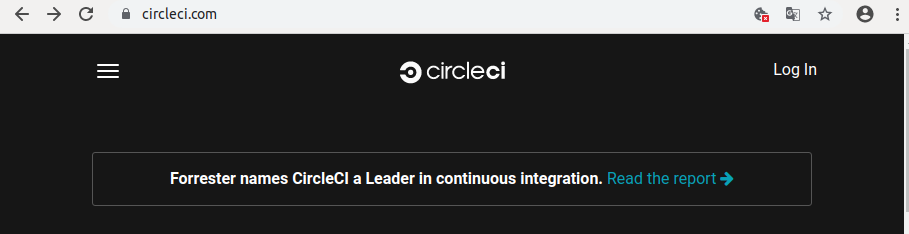

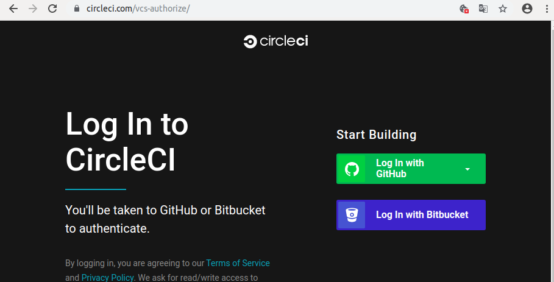

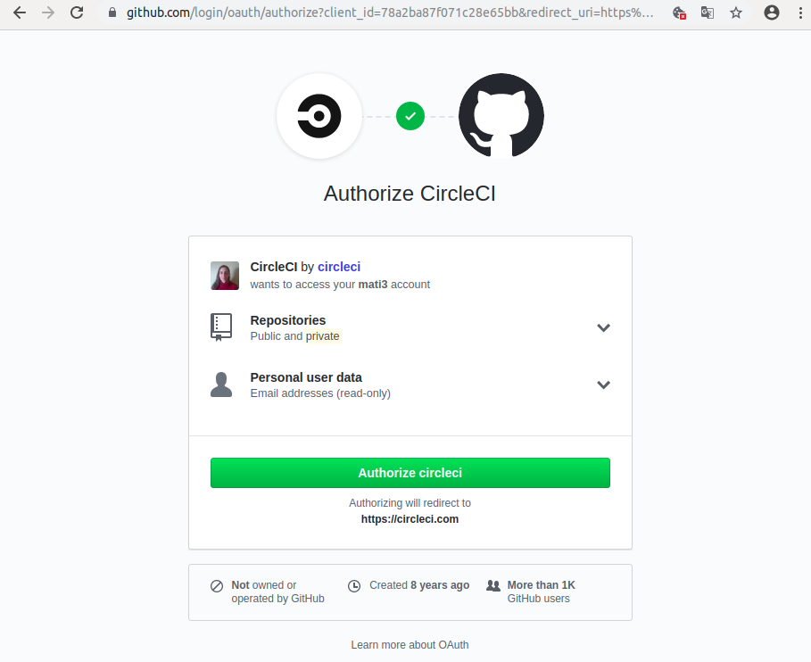

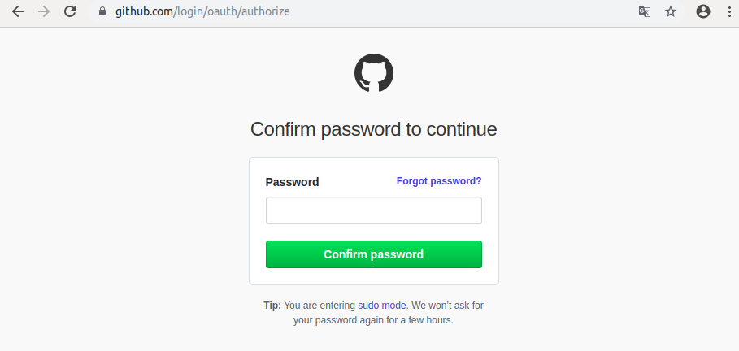

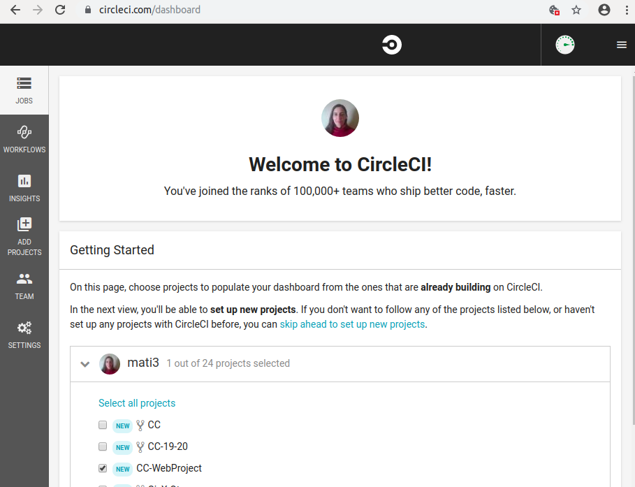

Incluimos a nuestro proyecto una carpeta llamada ".circleci" y dentro un archivo llamado config.yml para ejecutar la batería de test de Python en circleci.

[Tutoriales de circleci](https://circleci.com/docs/2.0/tutorials/)
[Tutorial lenguaje Python](https://circleci.com/docs/2.0/language-python/)

Nuestro archivo config.yml queda de la siguiente manera:

    version: 2
    jobs:
      build:
        docker:
          - image: circleci/python:3.6
        steps:
          - checkout
          - run:
              name: Install Python dependencies in a venv
              command: |
                virtualenv venv
                . venv/bin/activate 
                pip3 install -r requirements.txt

          - run:
              name: Runnning tests
              command: |
                . venv/bin/activate 
                invoke test

Status Badges de Circleci: 

A continuación hacemos la integración en local para nuevas invorporaciones con un script:

    #!/bin/bash
    # -*- coding: utf-8 -*-

    echo '###### Instalando pip3 ######'
    sudo apt install python3-pip -y

    echo '###### Instalando virtualenv ######'
    sudo pip3 install virtualenv

    echo '###### Creando carpeta lenv para marco de trabajo ######'
    virtualenv lenv -p python3

    echo '###### Activando carpeta lenv para marco de trabajo ######'
    source lenv/bin/activate

    echo '###### Instalando los requerimientos ######'
    pip3 install -r requirements.txt

    echo '###### Instalación completada con el marco de trabajo para python ######'
    echo ' Para activar el parco de trabajo ejecute en su terminal: '
    echo '      source lenv/bin/activate '
    echo ' Para ejecutar la batería de test ejecute en su terminal: '
    echo '      pytest '

Por último vamos al archivo gitignore y le diremos los archivos y directorios que queremos no suba al repositorio. Así evitamos enviar código privado, archivos binarios del control de versiones, instalaciones, etc.

