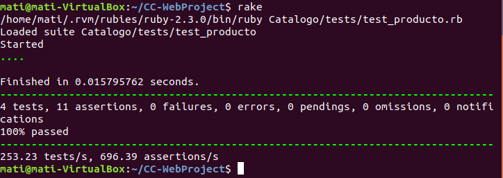
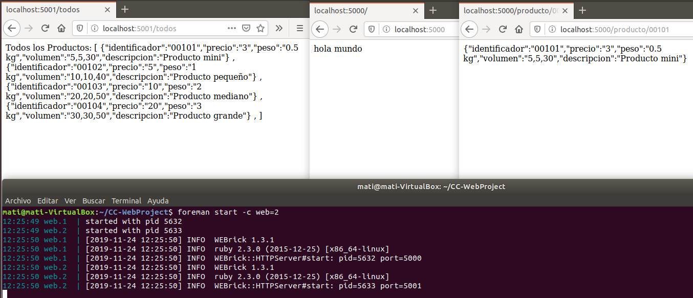
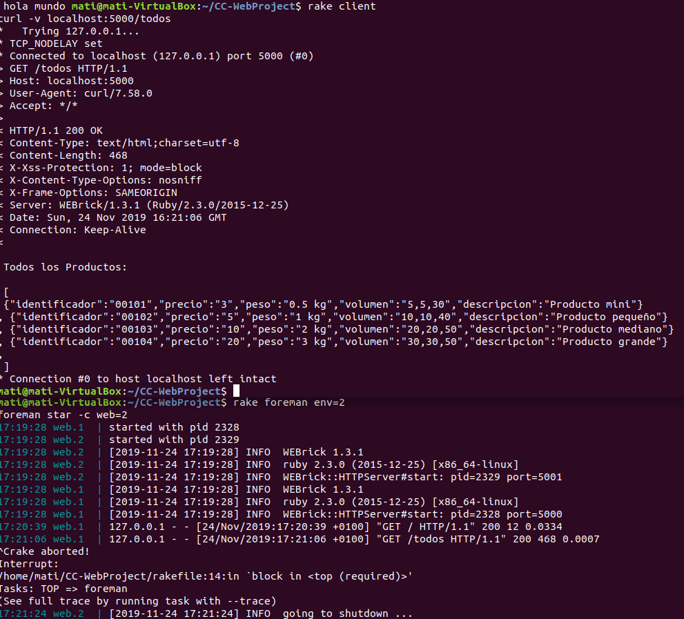

#Microservicio:

Hemos elegido levantar el microservicio de Ruby en nuestra aplicación.

Primero vamos a levantar una api rest con un mensaje de "hola mundo" para asegurar esta parte. Creamos un archivo "app_catalogo.rb" con el siguiente contenido:

    require_relative  'src/catalogo'
    require  'sinatra'

        set :port, 5000

        get '/' do
            'hola mundo'
        end

Lo probamos con la orden: ruby app_catalogo.rb

Posteriormente hemos desacoplado el modelo del sistema real, elevando a un nivel superior la ejecución de nuestra clase "producto", hemos creado la clase "catalogo" y un fichero de prueba .json que haría de base de datos para probar su funcionalidad. Hemos añadido varias rutas en nuestra api rest, podemos usar las siguientes:

        http://localhost:5000                       # hola mundo
        http://localhost:5000/todos                 # json con todos los productos
        http://localhost:5000/producto/00101        # json con el producto que tiene definido esa ID
        http://localhost:5000/producto/00102
        http://localhost:5000/producto/00103
        http://localhost:5000/producto/00104

Creamos pruebas con [Rack-Test](http://sinatrarb.com/testing.html) para la app creada, por la versión de Ruby que usamos, creemos que Rack-Test es el más indicado, en la misma documentación de [Sinatra](http://sinatrarb.com/faq.html) se muestra como hacer los test de autentificación con Rack-Test aunque nosotros no lo hemos implementado.

Destacamos el siguiente código de los test:

    def app
        app = lambda { |env| [200, {'Content-Type' => 'text/plain'}, ['All responses are OK']] }
        builder = Rack::Builder.new
        builder.run app
    end

Hemos guardado [Lamda](https://www.rubyguides.com/2016/02/ruby-procs-and-lambdas/) en una variable, lambda es una forma de definir un bloque junto con sus parámetros, env es un objeto hash que contiene los datos sobre nuestra solicitud y respuesta.
[Rack::Builder](https://thoughtbot.com/upcase/videos/rack) es un patrón que nos permite definir nuestra aplicación y la pila de middleware que la envuelve, es decir, se creará una pila enumerada en un orden y se ejecutá en ese mismo orden.

Ejemplo de ejecución:

***Administrando nuestra aplicación***

Como en el caso anterior, esta es la parte más difícil puesto que cambia el flujo de datos y necesitamos descomponer el problema para ir resolviéndolo.
Queremos levantar varios servicios web de nuestro microservicio al mismo tiempo. Hemos elegido [foreman](https://github.com/ddollar/foreman) para ello como administrador, necesitamos un archivo procfile, en este se llama al gestor de procesos web rackup, así que haremos este último el primero.

Llamamos a rackup desde la terminal, para ello necesitamos un archivo config.ru donde pondremos los requerimientos:

        require './Catalogo/app_catalogo'

        run App

En el archivo "app_catalogo.rb" tenemos que añadir lo siguiente que englobará el código:

        class App < Sinatra::Base
            ....
        end 

Procfile:

        web:rackup -p $PORT

A tener en cuenta:
-  Al llamar al servicio con rackup hay que cambiar la ruta para leer el archivo "json", ya que rack lo busca desde el directorio raíz.
-  Si ponemos "run" en el archivo config.ru, no admite el puerto del archivo "App", para conservar este puerto debemos llamar a "run" desde el propio archivo. Si hacemos esto hay que definir varios puertos cuando usamos foreman (foreman usa por defecto el puerto 5000 y en levantamiento de múltiples servicios va sumando desde 5000 hasta la cantidad que hayamos definido). 

-  Creemos que la mejor opción es dejar "run" en el archivo config.ru desacoplando la ejecución del propio servicio.

Gemfile:

        gem 'foreman'

Para levantar dos procesos web con foreman:

        foreman start -c web=2

Añadimos todo lo nuevo a nuestro Rakefile para automatizar las tareas:

      # en terminal: rake foreman env='cantidad'
      task :foreman do
        num = ENV['env']
        sh "foreman start -c web=#{num} "
      end

      task :client do
        sh "curl -v localhost:5000/todos"
      end

Ejemplo de uso:

