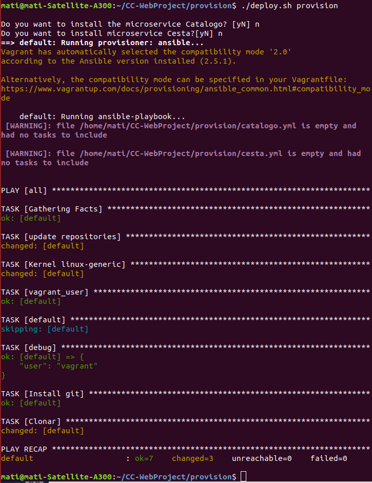
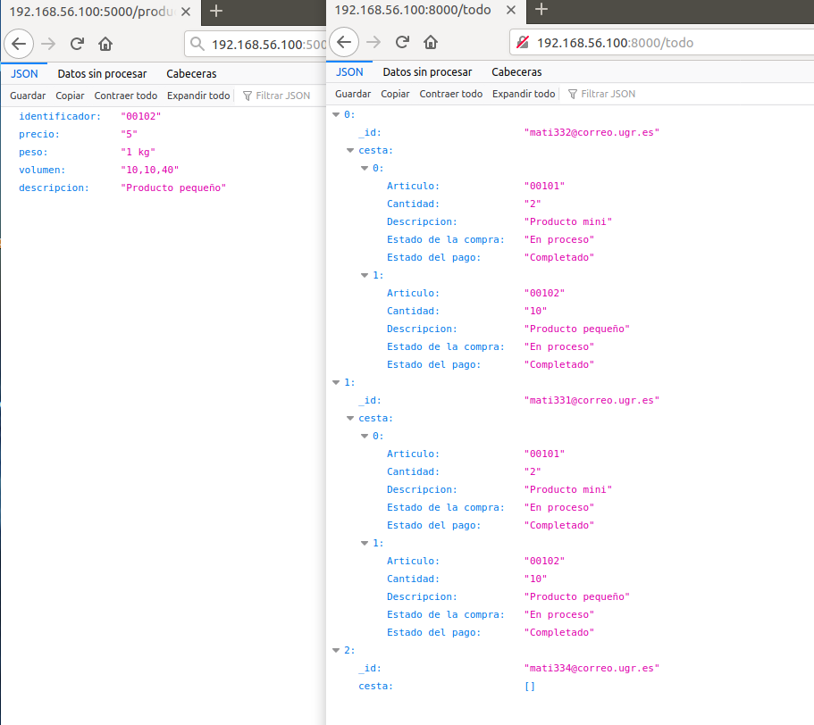
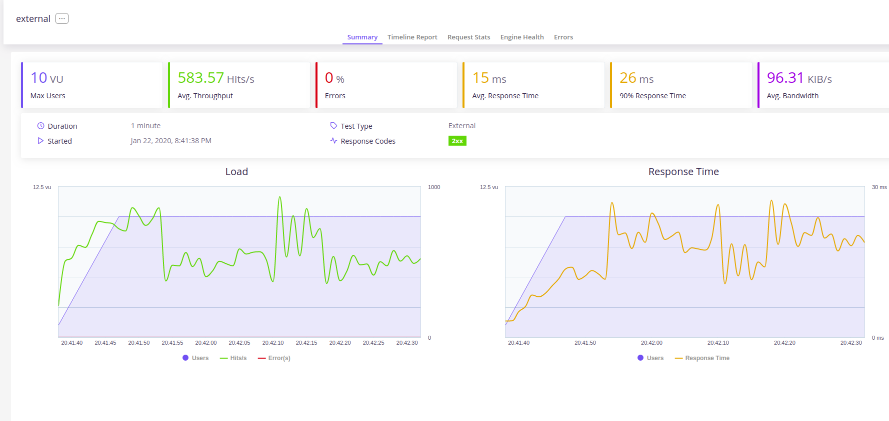
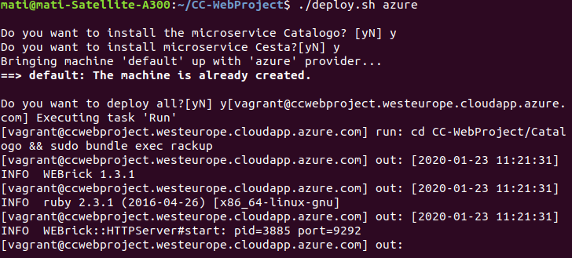

# Despliegue y Provisión

Hemos hecho dos despliegues, una primera en una maquina local virtualbox aprovisionada con Ansible y creada con Vagrant. Un segundo despliegue en la nube de Azure.

Para ambos hemos aprovisionado nuestras maquinas con Ansible, para más detalles ver la documentación extendida de [Ansible](ansible.md).

## Despliegue en local

Para crear y manejar máquinas virtuales con un mismo entorno de trabajo necesitamos Vagrant que ejecutará un archivo Vagrantfile, para nuestro despliegue en local hemos usado el siguiente:

        Vagrant.configure('2') do |config|

          config.vm.box = "bento/ubuntu-16.04"
          config.vm.hostname = "CC-WebProject"

          config.vm.network "private_network", ip: "192.168.56.100"

          config.vm.provision "ansible" do |ansible|
              ansible.playbook = "provision/workstation.yml"
              ansible.extra_vars={ 
            vagrant_user: "mati", 
            var_catalogo: "#{ENV['var_catalogo']}",
            var_cesta: "#{ENV['var_cesta']}"
              }
          end

        end

Especificamos la ip y el nombre de la maquina virtual en VirtualBox. Este archivo aprovisionara la maquina virtual con nuestro archivo workstation.yml

Para el despliegue en local usamos un archivo "deploy.sh" que mostramos y comentamos a continuación:

        #!/bin/bash

        var_catalogo="no"
        var_cesta="no"

        echo " "
        read -p "Do you want to install the microservice Catalogo? [yN] " -n 1 -r
        if [[ $REPLY =~ ^[Yy]$ ]]; then
        var_catalogo="yes"
        fi
        echo " "
        read -p 'Do you want to install microservice Cesta?[yN] ' -n 1 -r 
        if [[ $REPLY =~ ^[Yy]$ ]]; then
        var_cesta="yes"
        fi
        echo " "

        if [[ $1 == 'up' ]]; then 
            var_cesta=$var_cesta var_catalogo=$var_catalogo vagrant up
        elif [[ $1 == 'provision' ]]; then 
            var_cesta=$var_cesta var_catalogo=$var_catalogo vagrant provision
        elif [[ $1 == 'local' ]]; then 
            ansible-playbook --extra-vars "var_catalogo=$var_catalogo var_cesta=$var_cesta" --connection=local --inventory 172.0.0.1, workstation.yml
        else
            echo " "
            echo -e "    \033[31mThe options of use are 'up', 'provision' or 'local'\033[0m"
            echo " "
            echo -e "   Use '\033[33m./deploy up\033[0m' if it is the first and you want to use a virtual machine "
            echo " "
            echo -e "   Use '\033[33m./deploy provision\033[0m' if you just have a virtual machine and you want to repeat the provision "
            echo " "
            echo -e "   Use '\033[33m./deploy local\033[0m' if you want to be the install in your machine local "
        fi

En el archivo "deploy.sh" se diferencia para hacer el despliegue en las siguientes ordenes que el propio archivo muestra cuando no le pasas uno de los parámetros indicados:

    ./deploy.sh up # para levantar la maquina
    ./deploy.sh provision # para aprovisionar la maquina una vez levantada.
    ./deploy.sh local # para instalar los microservicios en tu propia máquina.

Definimos dos variables, para microservicio cesta y catalogo, el usuario tendrá que indicar si quiere aprovisionar su instalación con estos microservicios.

Vemos el funcionamiento:

Para este despliegue hemos medido las prestaciones, por supuesto no ha dado las mínimas exigidas, estamos en nuestro propio equipo, VirtualBox asigna solo 1 cpu a la máquina virtual. Estos son los mejores resultados obtenidos:

## Despliegue en Azure

Vamos a desplegar nuestro proyecto en Microsoft Azure, para más detalles de la configuración de Azure visitar la [documentación extendida](azure.md).

Para crear y manejar máquinas virtuales en Azure necesitamos cambiar nuestro Vagrantfile, enlace a la documentación extendida del [Vagrantfile](vagrantfile.md) del proyecto.

Como ya hemos comentado la provisión la haremos con [Ansible](ansible.md).

Para el despliegue, vamos a añadir Fabric al archivo "deploy.sh", 

Instalo con la orden "sudo apt install fabric".

Creamos una carpeta llamada "despliegue" donde generamos nuestro "fabfile.py", el cual queda con el siguiente aspecto:

        from fabric.api import *

        def Remove():
            run('sudo rm -rf ./CC-WebProject')

        def Install():
            Remove()
            run('git clone https://github.com/mati3/CC-WebProject.git')
            run('cd CC-WebProject/Catalogo && bundle install')
            run('pip3 install -r CC-WebProject/Cesta/requirements.txt')
            
        def Run():
            run('cd CC-WebProject/Catalogo && sudo bundle exec rackup --host 0.0.0.0 -p 5000',pty=False)
            run('cd CC-WebProject/Cesta && gunicorn --bind=0.0.0.0 -w 1 appCesta:app')

        def Update():
            Install()
            Run()

Para desplegar añadimos al archivo "deploy.sh" lo siguiente:

        elif [[ $1 == 'azure' ]]; then 
            var_cesta=$var_cesta var_catalogo=$var_catalogo vagrant up --provider=azure

        echo " " 
        read -p 'Do you want to deploy all?[yN] ' -n 1 -r 
        if [[ $REPLY =~ ^[Yy]$ ]]; then
        fab -f despliegue/fabfile.py -H vagrant@ccwebproject.westeurope.cloudapp.azure.com Run
        fi

Ejecutamos para comprobar mi aplicación (primero tenemos que iniciar la máquina en azure):

    ./deploy.sh azure

