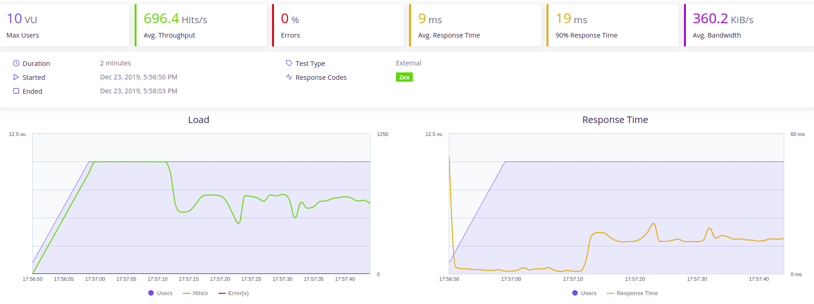

## Medición de prestaciones

[Taurus](https://gettaurus.org/) es un "wrapper" para los test de JMeter, de forma que facilita la tarea para desarrollar un script. Es una herramienta de código abierto con la ventaja de la facilidad de los escenarios para las mediciones de prestaciones, y con la posibilidad de ver en tiempo real la ejecución de la prueba.

- Instalamos [Taurus](https://gettaurus.org/docs/JMeter/) usando virtualenv siguiendo los pasos de su [guía](https://gettaurus.org/docs/Installation/)  de instalación para Ubuntu.

- Tenemos que generar un archivo "taurus.yml", que no es más que un script para JMeter usando la sintaxis .yml de configuración de Taurus para crear un escenario de prueba.

    execution:
    - concurrency: 10 # usuarios 
      ramp-up: 1m # tiempo de aceleración = 1 mín
      hold-for: 3m # duración de la prueba = 2 minutos
      throughput: 1000 # limitamos a 1000 solicitudes por segundo
      steps: 100 # numero de pasos, se distribuye el rendimiento entre los pasos y la aceleración definida.
      scenario: get-requests # escenario a ejecutar
     

    scenarios:
      get-requests:
        requests:
        - url: http://localhost:8000/cesta/mati331@correo.ugr.es
          method: GET

        - url: http://localhost:8000/clientes
          method: GET

        - url: http://localhost:8000/newcesta/mati331@correo.ugr.es/00101
          method: POST

- La primera vez que ejecutamos Taurus, se instala de forma automática lo necesario de JMeter. Para ejecutar el archivo "taurus.yml":

        bzt taurus.yml              # reporte sólo en la terminal
        bzt taurus.yml -report      # reporte en terminal y en la web
        bzt taurus.yml -gui         # abre la GUI de JMeter

- En nuestra primera prueba nos da los siguientes reportes:

- Siendo los resultados tan malos, lo primero que hago es comprobar mi cpu, tengo 2 cores, por lo tanto levanto 5 hilos para nuestra aplicación. También estoy usando una clase la cual elimino y dejo solo la base de datos mongodb. Los resultados mejoran notablemente:

- Podemos observar que de las tres llamadas que hacemos, "http://localhost:8000/newcesta/mati331@correo.ugr.es/00101" el tiempo de respuesta es casi el doble que del resto, y es porque se comunica con el otro microservicio "Catalogo", así que vamos a añadir [Flask-Caching](https://flask-caching.readthedocs.io/en/latest/), los tiempos mejoran notablemente, aunque debemos buscar otra solución puesto que evidentemente no se introducen datos usando caché:

- Hemos generado una clase para manejar los datos del microservicio "Catalogo", se recogen los datos en la instancia de la clase y luego se devuelven a la api rest según demanda. Ha sido un éxito, hemos conseguido los 10 procesos con mas de 1000 peticiones/s y con un tiempo de respuesta aceptable. Vemos a continuación dos imágenes, la primera con una limitación de 1000 peticiones/s y la segunda imagen sin dicha limitación.

- También hemos probado "eventlet", pero empieza a dar muchos errores, así que pruebo "meinheld" que es más conveniente, administrado por Gunicorn para aplicaciones en Flask y Python 3, no es mas que un servidor WSGI asíncrono para gunicorn, la diferencia no ha sido significativa por lo que se desestima.
  